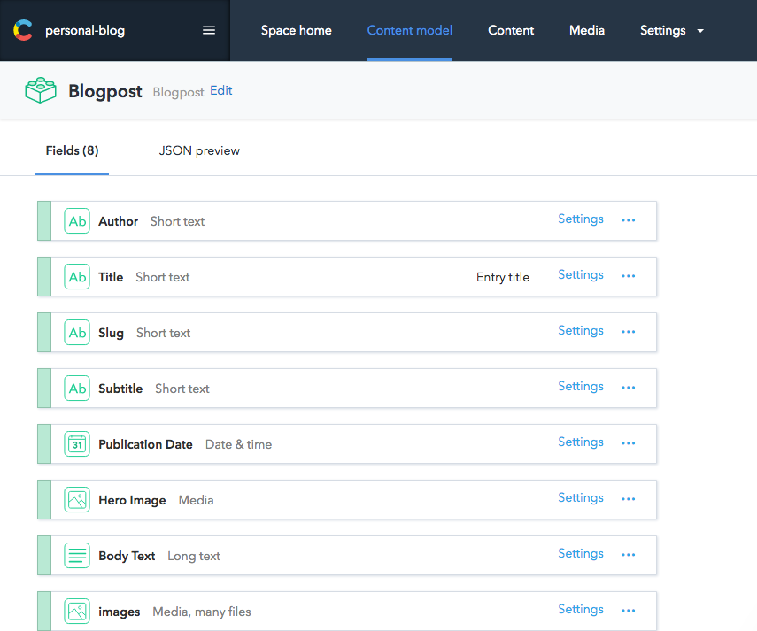

# Welcome to the Contentful-setup branch

## Getting started locally

Prerequisites - before getting started, you'll need Node and NPM on your machine. You will also need to Gatsby command line tool, which you can get with `npm install --g gatsby-cli`.

Moreover, to setup Contentful in this project, you will need your own SpaceId and AccessToken - these you can get once you make an account and content model in https://app.contentful.com. Follow the steps on the Contentful website to get these setup.

Then,
  1. Clone down this repository and install all the packages required for this repository by running `npm i` in the directory.
  2. Then, you'll need to create a file called `contentful-config.js` in the project's root directory. In this file, put your spaceId and accessToken in in the following format (number of 'x's corresponds to how long the codes should be):
  ```javascript
  module.exports = {
      spaceId: `xxxxxxxxxxxx`,
      accessToken: `xxxxxxxxxxxxxxxxxxxxxxxxxxxxxxxxxxxxxxxxxxxxxxxxxxxxxxxxxxxxxxxx`,
  }
  ```
  3. My own content model looks like this:

  

  If you want this project to work out the box, you'll need to set up the same content model as mine. Otherwise, set up your own and use GraphiQL* to explore your queries, and replace the existing page queries with whatever is appropriate.
  
  4. To see the site up and running, run `gatsby develop`
  5. Visit http://localhost:8000

  *To run GraphiQL run `gatsby develop` and visit http://localhost:8000/___graphql

## Key learnings/motivations

I was motivated to build this by an investigation into headless CMSes and by the wish to learn about static site renderers. Through this project, I have become interested in the [JAM stack](https://jamstack.org/), and what it presents for the future of web development.o

